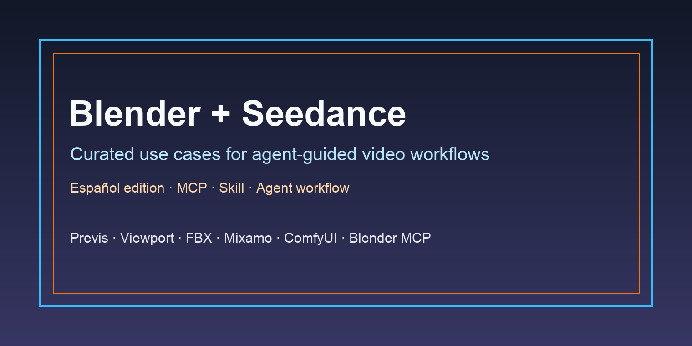

<div align="center">

<a href="#conversion-path-pending"></a>

[](LICENSE)
[](#conversion-path-pending)
[](#conversion-path-pending)
[](#conversion-path-pending)

[](README.md)
[](README_es.md)
[](README_pt.md)
[](README_ja.md)
[](README_ko.md)
[](README_de.md)
[](README_fr.md)
[](README_tr.md)
[](README_zh-TW.md)
[](README_zh-CN.md)
[](README_ru.md)

</div>

## 🍌 Introduction

Repositorio de casos de uso Blender + Seedance.

**Reunimos flujos reales de Blender, Blender MCP, viewport, previs, FBX, Mixamo, ComfyUI y agentes para controlar la generación de video con Seedance.**

La colección actual se deriva de datos X/Twitter proporcionados por el propietario. Cada caso enlaza la publicación original y el perfil del creador.

La landing principal está pendiente; la ruta prevista es instalar MCP, instalar la skill de EvoLink, recargar y usarla dentro de un agente.

## 📊 Overview

- **35 selected Blender + Seedance cases** from public creator posts in the owner-provided source dataset.
- Covers camera control, Blender previs, multi-character blocking, action choreography, Blender MCP, Codex/Claude-assisted blockouts, FBX/Mixamo references, ComfyUI/style transfer, and known limitations.
- Each case includes the original source, creator attribution, a concise takeaway, evidence type, and publication date.
- Use this repo to inspect practical workflows before routing users to the final EvoLink MCP + skill landing page.

> [!NOTE]
> La colección prioriza evidencia concreta: pasos, referencias de video, uso de agentes/MCP, restricciones reproducibles y límites claros.

<a id="-quick-api-access"></a>
## ⚡ Acceso rápido a API

Esta sección conserva la ruta esperada del modelo Seedance reference-to-video hasta que exista la landing final.

```bash
curl --request POST \
  --url https://direct.evolink.ai/v1/messages \
  --header 'Authorization: Bearer <token>' \
  --header 'Content-Type: application/json' \
  --data '
{
  "model": "seedance-2.0-reference-to-video",
  "max_tokens": 1024,
  "messages": [
    {
      "role": "user",
      "content": "Plan a Blender reference-video workflow for a Seedance shot."
    }
  ]
}
'
```

<a id="conversion-path-pending"></a>
## 🚧 Ruta de conversión pendiente

La landing final sigue pendiente. Sustituye esta sección por el CTA final antes de marcar el repositorio como listo para release.

## 📑 Menú

| Sección | Casos |
|---|---|
| [🎥 Camera Control & Previs](#camera-control-previs) | Case 1-8 |
| [🎬 Character & Action Blocking](#character-action-blocking) | Case 9-13 |
| [🤖 Agentic Blender MCP](#agentic-blender-mcp) | Case 14-19 |
| [🧩 Reference, Prompt & Multi-Input Mapping](#reference-prompt-multi-input-mapping) | Case 20-26 |
| [🛠️ Production Pipelines & Toolchains](#production-pipelines-toolchains) | Case 27-32 |
| [🧪 Limits, Tests & Troubleshooting](#limits-tests-troubleshooting) | Case 33-35 |
| [🙏 Agradecimientos](#acknowledge) | Credits and correction policy |

### [🎥 Camera Control & Previs](#camera-control-previs)

| Caso | Qué muestra | Tipo |
|---|---|---|
| [Blender Blockout as Seedance Motion Reference](#case-1) | Usa este caso para adapt 'Blender Blockout as Seedance Motion Reference' into a Blender-guided Seedance workflow. | Demo |
| [Camera Blocking with Midjourney Start Frame](#case-2) | Usa este caso para adapt 'Camera Blocking with Midjourney Start Frame' into a Blender-guided Seedance workflow. | Demo |
| [ComfyUI Camera Control with Blender Previs](#case-3) | Usa este caso para adapt 'ComfyUI Camera Control with Blender Previs' into a Blender-guided Seedance workflow. | Demo |
| [Blender Viewport as Scene Direction](#case-4) | Usa este caso para adapt 'Blender Viewport as Scene Direction' into a Blender-guided Seedance workflow. | Demo |
| [Viewport Preview for Character Animation](#case-5) | Usa este caso para adapt 'Viewport Preview for Character Animation' into a Blender-guided Seedance workflow. | Demo |
| [Navigable AI Filmmaking with Claude and Blender](#case-6) | Usa este caso para adapt 'Navigable AI Filmmaking with Claude and Blender' into a Blender-guided Seedance workflow. | Demo |
| [Viewport Preview to Realistic Start Frame](#case-7) | Usa este caso para adapt 'Viewport Preview to Realistic Start Frame' into a Blender-guided Seedance workflow. | Demo |
| [One Reference Video, Multiple Worlds](#case-8) | Usa este caso para adapt 'One Reference Video, Multiple Worlds' into a Blender-guided Seedance workflow. | Demo |

### [🎬 Character & Action Blocking](#character-action-blocking)

| Caso | Qué muestra | Tipo |
|---|---|---|
| [Multi-Character Dialogue with Matched Poses](#case-9) | Usa este caso para adapt 'Multi-Character Dialogue with Matched Poses' into a Blender-guided Seedance workflow. | Demo |
| [Basic Shapes for Multi-Character Shots](#case-10) | Usa este caso para adapt 'Basic Shapes for Multi-Character Shots' into a Blender-guided Seedance workflow. | Demo |
| [Action Choreography from Rough Blender Timing](#case-11) | Usa este caso para adapt 'Action Choreography from Rough Blender Timing' into a Blender-guided Seedance workflow. | Demo |
| [Handheld Follow Camera through Space](#case-12) | Usa este caso para adapt 'Handheld Follow Camera through Space' into a Blender-guided Seedance workflow. | Demo |
| [Camera and Character Blocking for Tactical Action](#case-13) | Usa este caso para adapt 'Camera and Character Blocking for Tactical Action' into a Blender-guided Seedance workflow. | Demo |

### [🤖 Agentic Blender MCP](#agentic-blender-mcp)

| Caso | Qué muestra | Tipo |
|---|---|---|
| [Codex + Blender MCP Reference Video Workflow](#case-14) | Usa este caso para adapt 'Codex + Blender MCP Reference Video Workflow' into a Blender-guided Seedance workflow. | Integration |
| [No-Click Blender Animation with Agent Assistance](#case-15) | Usa este caso para adapt 'No-Click Blender Animation with Agent Assistance' into a Blender-guided Seedance workflow. | Integration |
| [One-Prompt Blender MCP Blockout](#case-16) | Usa este caso para adapt 'One-Prompt Blender MCP Blockout' into a Blender-guided Seedance workflow. | Integration |
| [Codex-Built Architecture and Camera Work](#case-17) | Usa este caso para adapt 'Codex-Built Architecture and Camera Work' into a Blender-guided Seedance workflow. | Integration |
| [Beginner Agent-Assisted HIPHOP Reference Test](#case-18) | Usa este caso para adapt 'Beginner Agent-Assisted HIPHOP Reference Test' into a Blender-guided Seedance workflow. | Integration |
| [Codex MCP Direct Blender Export](#case-19) | Usa este caso para adapt 'Codex MCP Direct Blender Export' into a Blender-guided Seedance workflow. | Integration |

### [🧩 Reference, Prompt & Multi-Input Mapping](#reference-prompt-multi-input-mapping)

| Caso | Qué muestra | Tipo |
|---|---|---|
| [Reproducible Seedance Prompt with Blender Reference](#case-20) | Usa este caso para adapt 'Reproducible Seedance Prompt with Blender Reference' into a Blender-guided Seedance workflow. | Tutorial |
| [Character Mapping from Blocking and Reference Images](#case-21) | Usa este caso para adapt 'Character Mapping from Blocking and Reference Images' into a Blender-guided Seedance workflow. | Tutorial |
| [FBX Animation Export as Seedance Reference](#case-22) | Usa este caso para adapt 'FBX Animation Export as Seedance Reference' into a Blender-guided Seedance workflow. | Tutorial |
| [Director Checklist for Camera and Lens Control](#case-23) | Usa este caso para adapt 'Director Checklist for Camera and Lens Control' into a Blender-guided Seedance workflow. | Tutorial |
| [Action Shot Direction with Blender Camera Planning](#case-24) | Usa este caso para adapt 'Action Shot Direction with Blender Camera Planning' into a Blender-guided Seedance workflow. | Tutorial |
| [Mixamo Motion as Beginner Blender Reference](#case-25) | Usa este caso para adapt 'Mixamo Motion as Beginner Blender Reference' into a Blender-guided Seedance workflow. | Tutorial |
| [Composition Reference with Person and Vehicle Refs](#case-26) | Usa este caso para adapt 'Composition Reference with Person and Vehicle Refs' into a Blender-guided Seedance workflow. | Tutorial |

### [🛠️ Production Pipelines & Toolchains](#production-pipelines-toolchains)

| Caso | Qué muestra | Tipo |
|---|---|---|
| [Hermes, Krea, ComfyUI and Blender MCP Stack](#case-27) | Usa este caso para adapt 'Hermes, Krea, ComfyUI and Blender MCP Stack' into a Blender-guided Seedance workflow. | Integration |
| [Blender MCP Viewport to Seedance Style Transfer](#case-28) | Usa este caso para adapt 'Blender MCP Viewport to Seedance Style Transfer' into a Blender-guided Seedance workflow. | Integration |
| [Seedance Pro Viewport Style Transfer](#case-29) | Usa este caso para adapt 'Seedance Pro Viewport Style Transfer' into a Blender-guided Seedance workflow. | Integration |
| [Blender Previz to Anime Seedance Render](#case-30) | Usa este caso para adapt 'Blender Previz to Anime Seedance Render' into a Blender-guided Seedance workflow. | Integration |
| [FBX Clay Pass with Claude-Keyframed Camera](#case-31) | Usa este caso para adapt 'FBX Clay Pass with Claude-Keyframed Camera' into a Blender-guided Seedance workflow. | Integration |
| [Two-Night Hybrid Short Film Pipeline](#case-32) | Usa este caso para adapt 'Two-Night Hybrid Short Film Pipeline' into a Blender-guided Seedance workflow. | Integration |

### [🧪 Limits, Tests & Troubleshooting](#limits-tests-troubleshooting)

| Caso | Qué muestra | Tipo |
|---|---|---|
| [Camera Rhythm Control and Foot-Sliding Limits](#case-33) | Usa este caso para adapt 'Camera Rhythm Control and Foot-Sliding Limits' into a Blender-guided Seedance workflow. | Limit |
| [Reference-Only Blender Blockout without Start Frame](#case-34) | Usa este caso para adapt 'Reference-Only Blender Blockout without Start Frame' into a Blender-guided Seedance workflow. | Limit |
| [Mixamo Multi-Character Storyboard Experiment](#case-35) | Usa este caso para adapt 'Mixamo Multi-Character Storyboard Experiment' into a Blender-guided Seedance workflow. | Limit |

## 🎥 Camera Control & Previs

<a id="case-1"></a>
### Case 1: [Blender Blockout as Seedance Motion Reference](https://x.com/noman23761/status/2071534020014563328) (by [@noman23761](https://x.com/noman23761))

**Usa este caso para adapt 'Blender Blockout as Seedance Motion Reference' into a Blender-guided Seedance workflow.**

- Notas de la fuente: curated because the source describes a concrete Blender + Seedance workflow rather than a generic showcase.
- Reuse angle: 可直接改写成“用 Blender blockout 精准导演 AI 镜头”的主 use case。
- Context summary: Spent months prompting video models and only just figured out what was missing: prompting is describing a shot, you write what you want and hope the model interprets the camera the way you meant. Blocking it out in Blender first is directing it. The workflow...

Tipo: Demo | Fecha: 2026-06-29

---

<a id="case-2"></a>
### Case 2: [Camera Blocking with Midjourney Start Frame](https://x.com/reidhannaford/status/2069074506849685773) (by [@reidhannaford](https://x.com/reidhannaford))

**Usa este caso para adapt 'Camera Blocking with Midjourney Start Frame' into a Blender-guided Seedance workflow.**

- Notas de la fuente: curated because the source describes a concrete Blender + Seedance workflow rather than a generic showcase.
- Reuse angle: 适合做 precision camera control 的基础案例。
- Context summary: This is wild. Every filmmaker needs to try this hybrid AI workflow for precision camera control: 1) Block out your camera in Blender to create a motion reference and animate the camera move 2) Generate your start frame in Midjourney to match the pose and...

Tipo: Demo | Fecha: 2026-06-22

---

<a id="case-3"></a>
### Case 3: [ComfyUI Camera Control with Blender Previs](https://x.com/JMSvid/status/2070258132840796579) (by [@JMSvid](https://x.com/JMSvid))

**Usa este caso para adapt 'ComfyUI Camera Control with Blender Previs' into a Blender-guided Seedance workflow.**

- Notas de la fuente: curated because the source describes a concrete Blender + Seedance workflow rather than a generic showcase.
- Reuse angle: 适合做多输入相机控制 case。
- Context summary: Seedance 2 has insane motion adherence. This was a test to see how far I could push camera control by using a Blender previz as the guide in Comfy. The model had three inputs: - the Blender previz - a reference frame for the upright world - a reference frame...

Tipo: Demo | Fecha: 2026-06-25

---

<a id="case-4"></a>
### Case 4: [Blender Viewport as Scene Direction](https://x.com/KimAkiyama81/status/2070668362229690789) (by [@KimAkiyama81](https://x.com/KimAkiyama81))

**Usa este caso para adapt 'Blender Viewport as Scene Direction' into a Blender-guided Seedance workflow.**

- Notas de la fuente: curated because the source describes a concrete Blender + Seedance workflow rather than a generic showcase.
- Reuse angle: 适合作为 viewport reference 简短案例。
- Context summary: Using Viewport in Blender gives incredible control for directing scenes in Seedance 2.0!

Tipo: Demo | Fecha: 2026-06-27

---

<a id="case-5"></a>
### Case 5: [Viewport Preview for Character Animation](https://x.com/KimAkiyama81/status/2070266267051667505) (by [@KimAkiyama81](https://x.com/KimAkiyama81))

**Usa este caso para adapt 'Viewport Preview for Character Animation' into a Blender-guided Seedance workflow.**

- Notas de la fuente: curated because the source describes a concrete Blender + Seedance workflow rather than a generic showcase.
- Reuse angle: 适合作为 viewport preview 候选。
- Context summary: You can use Viewport preview in Blender and animate your character in Seedance with it! Sharing process below ⬇️⬇️⬇️

Tipo: Demo | Fecha: 2026-06-25

---

<a id="case-6"></a>
### Case 6: [Navigable AI Filmmaking with Claude and Blender](https://x.com/Flagiuss/status/2071335816190902624) (by [@Flagiuss](https://x.com/Flagiuss))

**Usa este caso para adapt 'Navigable AI Filmmaking with Claude and Blender' into a Blender-guided Seedance workflow.**

- Notas de la fuente: curated because the source describes a concrete Blender + Seedance workflow rather than a generic showcase.
- Reuse angle: 适合做未来式 camera control 叙事素材。
- Context summary: Seedance + Claude + Blender A future of AI film making is definitely in ability to navigate within films as if in 3D environments . That can give a lot of camera control, movements control, pacing and much more! Visual direction and finetuning will be mind...

Tipo: Demo | Fecha: 2026-06-28

---

<a id="case-7"></a>
### Case 7: [Viewport Preview to Realistic Start Frame](https://x.com/DiabloNemesis/status/2070441923706503380) (by [@DiabloNemesis](https://x.com/DiabloNemesis))

**Usa este caso para adapt 'Viewport Preview to Realistic Start Frame' into a Blender-guided Seedance workflow.**

- Notas de la fuente: curated because the source describes a concrete Blender + Seedance workflow rather than a generic showcase.
- Reuse angle: 适合做 viewport preview → Seedance 的短教程案例。
- Context summary: prompting is the old way. this is directing. – block out the scene in blender – export the viewport preview – extract the first frame → turn it into a realistic image in @morphic – drop it into as reference to video – Seedance 2.0 does the rest...

Tipo: Demo | Fecha: 2026-06-26

---

<a id="case-8"></a>
### Case 8: [One Reference Video, Multiple Worlds](https://x.com/koldo2k/status/2071307945002815967) (by [@koldo2k](https://x.com/koldo2k))

**Usa este caso para adapt 'One Reference Video, Multiple Worlds' into a Blender-guided Seedance workflow.**

- Notas de la fuente: curated because the source describes a concrete Blender + Seedance workflow rather than a generic showcase.
- Reuse angle: 适合做 style/world variation case。
- Context summary: Control with Blender, imagine with Seedance 2.0 🎬 Same reference video, different worlds. Here's the prompt I used to generate the video. The beginning is always the same only what happens in each scene changes.

Tipo: Demo | Fecha: 2026-06-28

---

## 🎬 Character & Action Blocking

<a id="case-9"></a>
### Case 9: [Multi-Character Dialogue with Matched Poses](https://x.com/reidhannaford/status/2069420552394043625) (by [@reidhannaford](https://x.com/reidhannaford))

**Usa este caso para adapt 'Multi-Character Dialogue with Matched Poses' into a Blender-guided Seedance workflow.**

- Notas de la fuente: curated because the source describes a concrete Blender + Seedance workflow rather than a generic showcase.
- Reuse angle: 适合做多角色表演/对话场景 use case。
- Context summary: I'm blown away. This AI filmmaking workflow for precise camera control, multiple characters, and dialogue is insane: 1. Generate a start frame in Midjourney 2. Match the poses in Blender, animate the camera 3. Feed both to Seedance I didn't think this would...

Tipo: Demo | Fecha: 2026-06-23

---

<a id="case-10"></a>
### Case 10: [Basic Shapes for Multi-Character Shots](https://x.com/reidhannaford/status/2069783215829569746) (by [@reidhannaford](https://x.com/reidhannaford))

**Usa este caso para adapt 'Basic Shapes for Multi-Character Shots' into a Blender-guided Seedance workflow.**

- Notas de la fuente: curated because the source describes a concrete Blender + Seedance workflow rather than a generic showcase.
- Reuse angle: 适合做“低成本 3D reference 就够用”的案例。
- Context summary: This is getting ridiculous. You need to try this AI filmmaking workflow. My Blender reference is embarrassingly simple. You can drive a precise multi-character shot with nothing but basic shapes. 1. Generate a start frame in Midjourney 2. Block out the scene...

Tipo: Demo | Fecha: 2026-06-24

---

<a id="case-11"></a>
### Case 11: [Action Choreography from Rough Blender Timing](https://x.com/reidhannaford/status/2070145120658137385) (by [@reidhannaford](https://x.com/reidhannaford))

**Usa este caso para adapt 'Action Choreography from Rough Blender Timing' into a Blender-guided Seedance workflow.**

- Notas de la fuente: curated because the source describes a concrete Blender + Seedance workflow rather than a generic showcase.
- Reuse angle: 适合做动作戏/空间调度 use case。
- Context summary: Ok, this is absurd. You can choreograph a complex action scene in Blender with basic shapes, then let Seedance make it real. You need to try this AI filmmaking workflow: 1. Generate a start frame in Midjourney 2. Block out the action in Blender 3. Feed both...

Tipo: Demo | Fecha: 2026-06-25

---

<a id="case-12"></a>
### Case 12: [Handheld Follow Camera through Space](https://x.com/reidhannaford/status/2070507963429671062) (by [@reidhannaford](https://x.com/reidhannaford))

**Usa este caso para adapt 'Handheld Follow Camera through Space' into a Blender-guided Seedance workflow.**

- Notas de la fuente: curated because the source describes a concrete Blender + Seedance workflow rather than a generic showcase.
- Reuse angle: 适合做手持跟拍、角色移动穿越空间的案例。
- Context summary: The previs workflow is still leveling up! My AI filmmaking process is starting to feel less like wrangling AI and more like animation. Still just cubes in Blender, but now I’m moving the character through space and doing a handheld camera follow. Same basic...

Tipo: Demo | Fecha: 2026-06-26

---

<a id="case-13"></a>
### Case 13: [Camera and Character Blocking for Tactical Action](https://x.com/SamJWasserman/status/2070742850095230991) (by [@SamJWasserman](https://x.com/SamJWasserman))

**Usa este caso para adapt 'Camera and Character Blocking for Tactical Action' into a Blender-guided Seedance workflow.**

- Notas de la fuente: curated because the source describes a concrete Blender + Seedance workflow rather than a generic showcase.
- Reuse angle: 适合做动作场景 tactical blocking case。
- Context summary: Finally got this @Blender → Seedance workflow working for not just camera blocking, but character blocking simultaneously. Camera orbit, lens choice, gunfire + cover positions, pop-outs. All directed from pre-vis prior to video generation. Prompt below. Made...

Tipo: Demo | Fecha: 2026-06-27

---

## 🤖 Agentic Blender MCP

<a id="case-14"></a>
### Case 14: [Codex + Blender MCP Reference Video Workflow](https://x.com/akiyoshisan/status/2071081230108660199) (by [@akiyoshisan](https://x.com/akiyoshisan))

**Usa este caso para adapt 'Codex + Blender MCP Reference Video Workflow' into a Blender-guided Seedance workflow.**

- Notas de la fuente: curated because the source describes a concrete Blender + Seedance workflow rather than a generic showcase.
- Reuse angle: 适合做 Agentic Blender MCP + Seedance use case。
- Context summary: SEIIIRUさんのを参考に、CodexからBlender MCPで試してみました。 投稿をみて、Blenderでもいけそう！と初のMCP繋いでやってみましたが中々難しいっす… ────────────── ▼ 試した内容 ・Blender MCP｜CodexからBlenderへ直接Python実行 ・簡易3Dシーン｜石畳の市場、木製の魚屋台、魚、猫を作成 ・猫モーション｜屋台に向かって歩く、止まる、魚を見る、前足を上げる ・カメラ設計｜猫・屋台・距離感が見える斜め構図で追従 ────────────── ▼...

Tipo: Integration | Fecha: 2026-06-28

---

<a id="case-15"></a>
### Case 15: [No-Click Blender Animation with Agent Assistance](https://x.com/AIWarper/status/2070162937181065547) (by [@AIWarper](https://x.com/AIWarper))

**Usa este caso para adapt 'No-Click Blender Animation with Agent Assistance' into a Blender-guided Seedance workflow.**

- Notas de la fuente: curated because the source describes a concrete Blender + Seedance workflow rather than a generic showcase.
- Reuse angle: 适合作为 agent-assisted/no-code workflow 候选。
- Context summary: Want to test the latest Seedance ref video trend but have no clue how to animate? This entire animation was done without a single mouse click in Blender Details below 👇

Tipo: Integration | Fecha: 2026-06-25

---

<a id="case-16"></a>
### Case 16: [One-Prompt Blender MCP Blockout](https://x.com/AIWarper/status/2070535586075885912) (by [@AIWarper](https://x.com/AIWarper))

**Usa este caso para adapt 'One-Prompt Blender MCP Blockout' into a Blender-guided Seedance workflow.**

- Notas de la fuente: curated because the source describes a concrete Blender + Seedance workflow rather than a generic showcase.
- Reuse angle: 适合作为 MCP blockout 能力和问题记录。
- Context summary: Blender MCP w/ Codex 5.5 or OPUS 4.8 is seriously pretty cracked... This entire block out was one-shot with a single prompt in about 15 minutes. Only problem I am having now is getting Seedance to use it properly 😅 Please feel free to use it and post your...

Tipo: Integration | Fecha: 2026-06-26

---

<a id="case-17"></a>
### Case 17: [Codex-Built Architecture and Camera Work](https://x.com/6_KAKUU/status/2071051063663452374) (by [@6_KAKUU](https://x.com/6_KAKUU))

**Usa este caso para adapt 'Codex-Built Architecture and Camera Work' into a Blender-guided Seedance workflow.**

- Notas de la fuente: curated because the source describes a concrete Blender + Seedance workflow rather than a generic showcase.
- Reuse angle: 适合做 Codex-assisted camera work case。
- Context summary: Blender × Seedance 2.0ってすごいな、本当に追従してくれるんだな。 Blenderインストールして３日目なんですが、建物からカメラワークまでCodex君が全てやってくれました。 ちなみにカメラワークの指示には、少し懐かしさを感じつつある矢印（Arrow）をCodexに対して使ってみた。

Tipo: Integration | Fecha: 2026-06-28

---

<a id="case-18"></a>
### Case 18: [Beginner Agent-Assisted HIPHOP Reference Test](https://x.com/Ukiyo_il/status/2071098235268071877) (by [@Ukiyo_il](https://x.com/Ukiyo_il))

**Usa este caso para adapt 'Beginner Agent-Assisted HIPHOP Reference Test' into a Blender-guided Seedance workflow.**

- Notas de la fuente: curated because the source describes a concrete Blender + Seedance workflow rather than a generic showcase.
- Reuse angle: 适合作为 beginner/agent-assisted experiment。
- Context summary: #Blender チャット内で話題だったBlenderを初めて触ってみました！ 操作画面はこんな感じ・・・マジわからにゃい（笑） 普段HANAKOぐらいしか触らないから（笑） これをエージェントに頼んで色々してもらう感じ 色々試してどっかからダウンロードでCodexちゃんに頼んで出来たのが２枚目の動画・・全然改善の余地はある ちょっと難しめのHIPHOPのダンスを渡してみたら・・・全然ダメでした・・３枚目の動画参考...

Tipo: Integration | Fecha: 2026-06-28

---

<a id="case-19"></a>
### Case 19: [Codex MCP Direct Blender Export](https://x.com/Toshi_nyaruo_AI/status/2071149652905537541) (by [@Toshi_nyaruo_AI](https://x.com/Toshi_nyaruo_AI))

**Usa este caso para adapt 'Codex MCP Direct Blender Export' into a Blender-guided Seedance workflow.**

- Notas de la fuente: curated because the source describes a concrete Blender + Seedance workflow rather than a generic showcase.
- Reuse angle: 适合做 beginner Codex MCP workflow。
- Context summary: seedance 2.0 & Blender で動画作成💞 CodexのMCPを使ってBlenderを直接操作して、動画の書き出しまで行っています。 Blenderは初めて触っているのですが、起動して2時間弱でここまで来ました。 seedanceに限らず、動画生成AIは狭い空間での描写が苦手なのですが、これで解消できるような気がします。 にしても、Blender

Tipo: Integration | Fecha: 2026-06-28

---

## 🧩 Reference, Prompt & Multi-Input Mapping

<a id="case-20"></a>
### Case 20: [Reproducible Seedance Prompt with Blender Reference](https://x.com/aidoga_lab/status/2070864815275585913) (by [@aidoga_lab](https://x.com/aidoga_lab))

**Usa este caso para adapt 'Reproducible Seedance Prompt with Blender Reference' into a Blender-guided Seedance workflow.**

- Notas de la fuente: curated because the source describes a concrete Blender + Seedance workflow rather than a generic showcase.
- Reuse angle: 适合做可复现 prompt/source case。
- Context summary: 再現用に条件を全部置いておきます。 ・スタートフレーム：添付のキャラ画像 ・参照動画：添付のBlender動画 ・モデル：Seedance 2.0 ・尺：5s 使ったプロンプト↓ RReference video 1 defines the camera movement, timing, and the walker's path ONLY — match its trajectory, speed, framing, and the walker's position and facing exactly....

Tipo: Tutorial | Fecha: 2026-06-27

---

<a id="case-21"></a>
### Case 21: [Character Mapping from Blocking and Reference Images](https://x.com/AIWarper/status/2069481237308452916) (by [@AIWarper](https://x.com/AIWarper))

**Usa este caso para adapt 'Character Mapping from Blocking and Reference Images' into a Blender-guided Seedance workflow.**

- Notas de la fuente: curated because the source describes a concrete Blender + Seedance workflow rather than a generic showcase.
- Reuse angle: 适合做 prompt engineering + character mapping case。
- Context summary: The TL:DR here is if you are proficient in blocking out animation inside of Blender (or whatever) you can really nail the exact shots you want. Here I attached these 3 ref images + the source video I linked above with this Seedance prompt: "In a retro 1980s...

Tipo: Tutorial | Fecha: 2026-06-23

---

<a id="case-22"></a>
### Case 22: [FBX Animation Export as Seedance Reference](https://x.com/AIWarper/status/2069847776620589430) (by [@AIWarper](https://x.com/AIWarper))

**Usa este caso para adapt 'FBX Animation Export as Seedance Reference' into a Blender-guided Seedance workflow.**

- Notas de la fuente: curated because the source describes a concrete Blender + Seedance workflow rather than a generic showcase.
- Reuse angle: 适合做 Mixamo/FBX animation reference pipeline。
- Context summary: I then just did the following: 1) import the first .fbx into blender 2) position my camera 3) export the animation to .mp4 (720 max res for Seedance ref videos) I did this for each clip, changing the camera angle each

Tipo: Tutorial | Fecha: 2026-06-24

---

<a id="case-23"></a>
### Case 23: [Director Checklist for Camera and Lens Control](https://x.com/ai_gezgini/status/2070531406237728977) (by [@ai_gezgini](https://x.com/ai_gezgini))

**Usa este caso para adapt 'Director Checklist for Camera and Lens Control' into a Blender-guided Seedance workflow.**

- Notas de la fuente: curated because the source describes a concrete Blender + Seedance workflow rather than a generic showcase.
- Reuse angle: 适合提炼为导演参数 checklist。
- Context summary: Seedance 2.0 ile video üretirken Blender bilenler çok şanslı… 🎬🔥 Çünkü artık olay sadece prompt yazmak değil. Blender’da önce sahneyi kabaca kendin kuruyorsun: → kamera açısı → karakter pozu → hareket yönü → ışık atmosferi → mekan derinliği → lens hissi →...

Tipo: Tutorial | Fecha: 2026-06-26

---

<a id="case-24"></a>
### Case 24: [Action Shot Direction with Blender Camera Planning](https://x.com/ai_gezgini/status/2071529677353615522) (by [@ai_gezgini](https://x.com/ai_gezgini))

**Usa este caso para adapt 'Action Shot Direction with Blender Camera Planning' into a Blender-guided Seedance workflow.**

- Notas de la fuente: curated because the source describes a concrete Blender + Seedance workflow rather than a generic showcase.
- Reuse angle: 适合提炼为动作镜头 prompt/control checklist。
- Context summary: Blender ile komando kadın sahnesi… 🎬 Blender + Seedance 2.0 = yönetmen koltuğu sende. → kamera nereye bakacak → karakter nereden girecek → hangi açıdan takip edilecek → hareket hangi yönde akacak → sahnenin derinliği nasıl olacak → final kadrajı nerede...

Tipo: Tutorial | Fecha: 2026-06-29

---

<a id="case-25"></a>
### Case 25: [Mixamo Motion as Beginner Blender Reference](https://x.com/tanabe_fragm/status/2070685291183243459) (by [@tanabe_fragm](https://x.com/tanabe_fragm))

**Usa este caso para adapt 'Mixamo Motion as Beginner Blender Reference' into a Blender-guided Seedance workflow.**

- Notas de la fuente: curated because the source describes a concrete Blender + Seedance workflow rather than a generic showcase.
- Reuse angle: 适合做 beginner motion-source case。
- Context summary: 巷で盛り上がっているBlender × Seedance 2.0のワークフローをテスト🎥 この手法だと、確かに細かい動きのコントロールができそう。 ただ、私みたいなBlender素人だと思い通りに動かすのが難しい...😓 次は、Blender MCPを試してみようと思います。 Higgsfieldとかが簡易的なツール（Viewport Preview Referenceという名称）を公開しそうなので、そっちを待つのも手だと思います。 クリエイターさん達はこういうのが作れて本当に凄い❗️と改めて思いました😃...

Tipo: Tutorial | Fecha: 2026-06-27

---

<a id="case-26"></a>
### Case 26: [Composition Reference with Person and Vehicle Refs](https://x.com/Gen_x111x/status/2069803766581526534) (by [@Gen_x111x](https://x.com/Gen_x111x))

**Usa este caso para adapt 'Composition Reference with Person and Vehicle Refs' into a Blender-guided Seedance workflow.**

- Notas de la fuente: curated because the source describes a concrete Blender + Seedance workflow rather than a generic showcase.
- Reuse angle: 适合做 multi-reference composition case。
- Context summary: 今回のおふざけAIですが Blenderで構図リファレンス と 私のリファレンス と パンダカーのリファレンス をうまいこと組み合わせる作りをしてみました🙏 CGでのカメラワーク指示は非常に重要です。これがないと言うこと聞かないんです そしてseedanceはリファレンス命ですな

Tipo: Tutorial | Fecha: 2026-06-24

---

## 🛠️ Production Pipelines & Toolchains

<a id="case-27"></a>
### Case 27: [Hermes, Krea, ComfyUI and Blender MCP Stack](https://x.com/SamJWasserman/status/2069656428437225826) (by [@SamJWasserman](https://x.com/SamJWasserman))

**Usa este caso para adapt 'Hermes, Krea, ComfyUI and Blender MCP Stack' into a Blender-guided Seedance workflow.**

- Notas de la fuente: curated because the source describes a concrete Blender + Seedance workflow rather than a generic showcase.
- Reuse angle: 适合做 multi-agent creative pipeline 候选。
- Context summary: Wild Experiment. Had my Hermes install @krea_ai 2 on the @NVIDIAAI Dgx Spark and connect it to @ComfyUI. Had Hermes then install @Blender and connect to it via the mcp. I had Hermes make a reference image in Krea2, + Physical ref vid in Blender. I then put...

Tipo: Integration | Fecha: 2026-06-24

---

<a id="case-28"></a>
### Case 28: [Blender MCP Viewport to Seedance Style Transfer](https://x.com/techhalla/status/2070814203435274715) (by [@techhalla](https://x.com/techhalla))

**Usa este caso para adapt 'Blender MCP Viewport to Seedance Style Transfer' into a Blender-guided Seedance workflow.**

- Notas de la fuente: curated because the source describes a concrete Blender + Seedance workflow rather than a generic showcase.
- Reuse angle: 适合做 Blender MCP + style transfer 主案例。
- Context summary: Adding 3D to your animation workflow gives you full control over the camera and every element in the scene. I built this viewport animation in Blender MCP, then took it into Seedance 2.0 in Magnific to add textures and lighting. Here's exactly how I did it 👇...

Tipo: Integration | Fecha: 2026-06-27

---

<a id="case-29"></a>
### Case 29: [Seedance Pro Viewport Style Transfer](https://x.com/techhalla/status/2070832621328732396) (by [@techhalla](https://x.com/techhalla))

**Usa este caso para adapt 'Seedance Pro Viewport Style Transfer' into a Blender-guided Seedance workflow.**

- Notas de la fuente: curated because the source describes a concrete Blender + Seedance workflow rather than a generic showcase.
- Reuse angle: 适合作为 style transfer 传播帖。
- Context summary: Seedance 2.0 pro + Blender viewport style transfer below 👇

Tipo: Integration | Fecha: 2026-06-27

---

<a id="case-30"></a>
### Case 30: [Blender Previz to Anime Seedance Render](https://x.com/restofart/status/2070086939756159368) (by [@restofart](https://x.com/restofart))

**Usa este caso para adapt 'Blender Previz to Anime Seedance Render' into a Blender-guided Seedance workflow.**

- Notas de la fuente: curated because the source describes a concrete Blender + Seedance workflow rather than a generic showcase.
- Reuse angle: 适合作为 anime/render pipeline case。
- Context summary: Made a 3D previz in Blender, then rendered it as anime with Seedance — all inside Doitong. Full camera moves and motion preserved. This previz → AI-render pipeline is how AI filmmaking beats "prompt and pray." Anyone else building this way? 👇...

Tipo: Integration | Fecha: 2026-06-25

---

<a id="case-31"></a>
### Case 31: [FBX Clay Pass with Claude-Keyframed Camera](https://x.com/Viggle_PINOC/status/2070183934265012392) (by [@Viggle_PINOC](https://x.com/Viggle_PINOC))

**Usa este caso para adapt 'FBX Clay Pass with Claude-Keyframed Camera' into a Blender-guided Seedance workflow.**

- Notas de la fuente: curated because the source describes a concrete Blender + Seedance workflow rather than a generic showcase.
- Reuse angle: 适合做 FBX/Mixamo 动画参考流程。
- Context summary: Step 2: Blender Import the FBX onto a clay model, then set your camera. We had Claude keyframe the camera moves, adjusted the angles, and rendered the clay pass. Export to mp4 for Seedance refs.

Tipo: Integration | Fecha: 2026-06-25

---

<a id="case-32"></a>
### Case 32: [Two-Night Hybrid Short Film Pipeline](https://x.com/VengadaS65199/status/2070049247823859770) (by [@VengadaS65199](https://x.com/VengadaS65199))

**Usa este caso para adapt 'Two-Night Hybrid Short Film Pipeline' into a Blender-guided Seedance workflow.**

- Notas de la fuente: curated because the source describes a concrete Blender + Seedance workflow rather than a generic showcase.
- Reuse angle: 适合做完整短片制作管线候选。
- Context summary: Pulled two all nighters making this. wrote, animated, edited, did SFX. couldn't sleep with the idea in my head. Seedance 2 for the characters. custom @ComfyUI nodes via Claude for the time-slice. rest in @Blender and AE

Tipo: Integration | Fecha: 2026-06-25

---

## 🧪 Limits, Tests & Troubleshooting

<a id="case-33"></a>
### Case 33: [Camera Rhythm Control and Foot-Sliding Limits](https://x.com/aidoga_lab/status/2070864749865398684) (by [@aidoga_lab](https://x.com/aidoga_lab))

**Usa este caso para adapt 'Camera Rhythm Control and Foot-Sliding Limits' into a Blender-guided Seedance workflow.**

- Notas de la fuente: curated because the source describes a concrete Blender + Seedance workflow rather than a generic showcase.
- Reuse angle: 适合做 limitations + troubleshooting case。
- Context summary: AI動画13日目。 Blender動画をSeedanceに参照させて、 カメラの動き・リズム・被写体の移動を制御するやり方にチャレンジしてみました。 結果、 カメラの動き・リズム・移動は、狙い通り制御できた。 でも"足の動き＝仕草"がうまくいかない。 Blender動画の動きをそのまま参照してしまって、自然な歩きにならない。 プロンプトでの制御も、モデル変更（mini→2.0）も試したけど、 どうしても足が滑ってしまう。 Blender動画側が正確な仕草をしてればクリアできる気はしてます。...

Tipo: Limit | Fecha: 2026-06-27

---

<a id="case-34"></a>
### Case 34: [Reference-Only Blender Blockout without Start Frame](https://x.com/magneticskiff/status/2070711034793361559) (by [@magneticskiff](https://x.com/magneticskiff))

**Usa este caso para adapt 'Reference-Only Blender Blockout without Start Frame' into a Blender-guided Seedance workflow.**

- Notas de la fuente: curated because the source describes a concrete Blender + Seedance workflow rather than a generic showcase.
- Reuse angle: 适合做 reference-only variant 候选。
- Context summary: Seedance + Blender blockout using references, no start frame. I've been messing with the Blender blockout, but for a lot of my own workflow I need to be able to do it using references without starter frames. This works well so far if you're environmental...

Tipo: Limit | Fecha: 2026-06-27

---

<a id="case-35"></a>
### Case 35: [Mixamo Multi-Character Storyboard Experiment](https://x.com/dave392750/status/2070851042661810551) (by [@dave392750](https://x.com/dave392750))

**Usa este caso para adapt 'Mixamo Multi-Character Storyboard Experiment' into a Blender-guided Seedance workflow.**

- Notas de la fuente: curated because the source describes a concrete Blender + Seedance workflow rather than a generic showcase.
- Reuse angle: 适合做 Mixamo motion complexity/troubleshooting case。
- Context summary: Blender絵コンテ、もう一作作ってみました。 メイドさんが走る映像ですが、はい最初から嘘が入ってますね^^; 本当はジャンプさせたかったのですが、うまくいかず、そこはSeedanceさんにお任せしました。 今回、Mixamoを動きに合わせて何体も使ったため、そこの収拾に困ることに^^; #capcut生成ai

Tipo: Limit | Fecha: 2026-06-27

---

<a id="acknowledge"></a>
## 🙏 Agradecimientos

This repository was inspired by creators who publicly shared Blender + Seedance workflows, tests, prompts, reference videos, and production notes.

- [@noman23761](https://x.com/noman23761)
- [@reidhannaford](https://x.com/reidhannaford)
- [@JMSvid](https://x.com/JMSvid)
- [@KimAkiyama81](https://x.com/KimAkiyama81)
- [@Flagiuss](https://x.com/Flagiuss)
- [@DiabloNemesis](https://x.com/DiabloNemesis)
- [@koldo2k](https://x.com/koldo2k)
- [@SamJWasserman](https://x.com/SamJWasserman)
- [@akiyoshisan](https://x.com/akiyoshisan)
- [@AIWarper](https://x.com/AIWarper)
- [@6_KAKUU](https://x.com/6_KAKUU)
- [@Ukiyo_il](https://x.com/Ukiyo_il)
- [@Toshi_nyaruo_AI](https://x.com/Toshi_nyaruo_AI)
- [@aidoga_lab](https://x.com/aidoga_lab)
- [@ai_gezgini](https://x.com/ai_gezgini)
- [@tanabe_fragm](https://x.com/tanabe_fragm)
- [@Gen_x111x](https://x.com/Gen_x111x)
- [@techhalla](https://x.com/techhalla)
- [@restofart](https://x.com/restofart)
- [@Viggle_PINOC](https://x.com/Viggle_PINOC)
- [@VengadaS65199](https://x.com/VengadaS65199)
- [@magneticskiff](https://x.com/magneticskiff)
- [@dave392750](https://x.com/dave392750)

*We cannot guarantee that every case is attributed to the original creator. If anything needs to be corrected, please contact us and we will update it.*

If you have more interesting usage cases to share, open an issue or pull request and help expand the EvoLink usecase library.

[](https://www.star-history.com/#cheercheung/Awesome-Blender-Seedance-Workflow-Usecases&Date)

