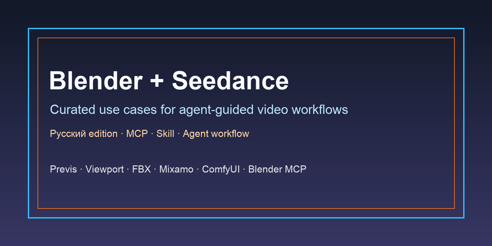

<div align="center">

<a href="#conversion-path-pending"></a>

[](LICENSE)
[](#conversion-path-pending)
[](#conversion-path-pending)
[](#conversion-path-pending)

[](README.md)
[](README_es.md)
[](README_pt.md)
[](README_ja.md)
[](README_ko.md)
[](README_de.md)
[](README_fr.md)
[](README_tr.md)
[](README_zh-TW.md)
[](README_zh-CN.md)
[](README_ru.md)

</div>

## 🍌 Introduction

Репозиторий use cases Blender + Seedance.

**Мы собираем реальные workflow с Blender, Blender MCP, viewport, previs, FBX, Mixamo, ComfyUI и агентами для управления генерацией видео Seedance.**

Текущая коллекция основана на X/Twitter данных, предоставленных владельцем. Каждый кейс ведет к исходному посту и профилю автора.

Основная landing page ожидается; планируемый путь: установить MCP, установить EvoLink skill, пополнить баланс и использовать внутри агента.

## 📊 Overview

- **20 отобранных кейсов Blender + Seedance** из публичных постов авторов в датасете владельца.
- Охватывает управление камерой, Blender previs, блокинг нескольких персонажей, постановку экшена, Blender MCP, blockout с Codex/Claude, FBX/Mixamo references, ComfyUI/style transfer и известные ограничения.
- Каждый кейс содержит исходный пост, автора, краткий вывод, тип доказательства и дату публикации.
- Публичный список был сокращен с 35 кандидатов до 20 основных кейсов после ручной проверки дубликатов и оригинальности.
- Этот repo помогает изучить реальные workflows перед переходом к финальной landing page EvoLink MCP + skill.

> [!NOTE]
> Коллекция ставит конкретные доказательства выше хайпа: шаги, reference video, agent/MCP, воспроизводимые условия и явные ограничения.

<a id="-quick-api-access"></a>
## ⚡ Быстрый доступ к API

До финальной landing page этот раздел фиксирует ожидаемый путь модели Seedance reference-to-video.

```bash
curl --request POST \
  --url https://direct.evolink.ai/v1/messages \
  --header 'Authorization: Bearer <token>' \
  --header 'Content-Type: application/json' \
  --data '
{
  "model": "seedance-2.0-reference-to-video",
  "max_tokens": 1024,
  "messages": [
    {
      "role": "user",
      "content": "Plan a Blender reference-video workflow for a Seedance shot."
    }
  ]
}
'
```

<a id="conversion-path-pending"></a>
## 🚧 Путь конверсии ожидается

Финальная landing page пока ожидается. Замените этот раздел финальным CTA перед статусом release-ready.

## 📑 Меню

| Раздел | Кейсы |
|---|---|
| [🎥 Camera Control & Previs / Управление камерой и превиз](#camera-control-previs) | Case 1-5 |
| [🎬 Character & Action Blocking / Блокинг персонажей и экшена](#character-action-blocking) | Case 6-9 |
| [🤖 Agentic Blender MCP / Агентный Blender MCP](#agentic-blender-mcp) | Case 10-11 |
| [🧩 Reference, Prompt & Multi-Input Mapping / Референсы, промпты и multi-input mapping](#reference-prompt-multi-input-mapping) | Case 12-14 |
| [🛠️ Production Pipelines & Toolchains / Производственные пайплайны и инструменты](#production-pipelines-toolchains) | Case 15-18 |
| [🧪 Limits, Tests & Troubleshooting / Ограничения, тесты и разбор ошибок](#limits-tests-troubleshooting) | Case 19-20 |
| [🙏 Благодарности](#acknowledge) | Credits and correction policy |

<a id="camera-control-previs"></a>
### 🎥 Camera Control & Previs / Управление камерой и превиз

| Кейс | Что показывает | Тип |
|---|---|---|
| [Blender Blockout as Seedance Motion Reference](#case-1) | A complete direction workflow: create a start frame, block the shot with gray boxes in Blender, animate only the camera and timing, then use that blockout as Seedance's motion reference. | Demo |
| [Camera Blocking with Midjourney Start Frame](#case-2) | A compact precision-camera recipe: Blender supplies the camera move, Midjourney supplies the start frame, and Seedance follows the motion reference. | Demo |
| [ComfyUI Camera Control with Blender Previs](#case-3) | A ComfyUI control case where Blender previz is combined with separate upright and upside-down reference frames to test motion adherence. | Demo |
| [Viewport Preview to Realistic Start Frame](#case-4) | A short viewport-preview tutorial: block out the scene, export the preview, turn the first frame realistic, then provide both references to Seedance. | Demo |
| [One Reference Video, Multiple Worlds](#case-5) | A style/world-variation case where the same Blender reference video drives different generated worlds in Seedance. | Demo |

<a id="character-action-blocking"></a>
### 🎬 Character & Action Blocking / Блокинг персонажей и экшена

| Кейс | Что показывает | Тип |
|---|---|---|
| [Multi-Character Dialogue with Matched Poses](#case-6) | A dialogue-shot workflow where Blender is used to match character poses and camera motion before Seedance generates the performed scene. | Demo |
| [Action Choreography from Rough Blender Timing](#case-7) | An action-previs case showing how rough timing, speed, camera shake, and spatial choreography can be planned in Blender before Seedance renders the shot. | Demo |
| [Handheld Follow Camera through Space](#case-8) | A handheld-follow case where Blender controls how a character travels through space and Seedance carries the gritty camera move into the final video. | Demo |
| [Camera and Character Blocking for Tactical Action](#case-9) | A tactical blocking case where Blender directs camera orbit, lens choice, cover positions, gunfire beats, and character movement before generation. | Demo |

<a id="agentic-blender-mcp"></a>
### 🤖 Agentic Blender MCP / Агентный Blender MCP

| Кейс | Что показывает | Тип |
|---|---|---|
| [Codex + Blender MCP Reference Video Workflow](#case-10) | An agentic Blender MCP case where Codex builds a simple 3D market, cat motion, camera framing, and an MP4 reference for Seedance. | Integration |
| [Codex-Built Architecture and Camera Work](#case-11) | A Codex-assisted beginner case where architecture and camera work are generated in Blender and then tested as Seedance reference motion. | Integration |

<a id="reference-prompt-multi-input-mapping"></a>
### 🧩 Reference, Prompt & Multi-Input Mapping / Референсы, промпты и multi-input mapping

| Кейс | Что показывает | Тип |
|---|---|---|
| [Reproducible Seedance Prompt with Blender Reference](#case-12) | A reproducible prompt case with the start frame, Blender reference video, Seedance version, duration, and movement constraints all spelled out. | Tutorial |
| [Character Mapping from Blocking and Reference Images](#case-13) | A reference-mapping case that uses Blender blocking plus multiple character and environment references to tell Seedance which figure should become which character. | Tutorial |
| [Mixamo Motion as Beginner Blender Reference](#case-14) | A beginner-friendly motion-source case: use Mixamo motion in Blender as the controllable movement base before sending the reference to Seedance. | Tutorial |

<a id="production-pipelines-toolchains"></a>
### 🛠️ Production Pipelines & Toolchains / Производственные пайплайны и инструменты

| Кейс | Что показывает | Тип |
|---|---|---|
| [Hermes, Krea, ComfyUI and Blender MCP Stack](#case-15) | A multi-tool agent pipeline where Hermes installs and connects Krea, ComfyUI, Blender MCP, and Seedance to produce both image and physical references. | Integration |
| [Blender MCP Viewport to Seedance Style Transfer](#case-16) | A viewport-to-style-transfer case: Blender MCP provides camera and element control, then Seedance/Magnific add texture and lighting. | Integration |
| [Blender Previz to Anime Seedance Render](#case-17) | A 3D-previs-to-anime case showing how camera moves and motion can be preserved while Seedance changes the render style. | Integration |
| [FBX Clay Pass with Claude-Keyframed Camera](#case-18) | An FBX clay-pass workflow where Blender imports the motion, Claude helps keyframe camera moves, and the rendered pass becomes Seedance reference video. | Integration |

<a id="limits-tests-troubleshooting"></a>
### 🧪 Limits, Tests & Troubleshooting / Ограничения, тесты и разбор ошибок

| Кейс | Что показывает | Тип |
|---|---|---|
| [Camera Rhythm Control and Foot-Sliding Limits](#case-19) | A limitation case: Blender successfully controls camera, rhythm, and subject path, while natural foot motion still needs better handling. | Limit |
| [Reference-Only Blender Blockout without Start Frame](#case-20) | A no-start-frame variant showing that Blender blockout plus detailed environment references can work when the workflow cannot rely on a starter frame. | Limit |

<a id="camera-control-previs-cases"></a>
## 🎥 Camera Control & Previs / Управление камерой и превиз

<a id="case-1"></a>
### Case 1: [Blender Blockout as Seedance Motion Reference](https://x.com/noman23761/status/2071534020014563328) (by [@noman23761](https://x.com/noman23761))

**A complete direction workflow: create a start frame, block the shot with gray boxes in Blender, animate only the camera and timing, then use that blockout as Seedance's motion reference.**

- Заметки источника: The post describes the whole loop from image-model start frame to crude Blender camera blockout and Seedance motion-reference generation.
- Audit status: kept after manual duplicate and originality review.


Тип: Demo | Дата: 2026-06-29

---

<a id="case-2"></a>
### Case 2: [Camera Blocking with Midjourney Start Frame](https://x.com/reidhannaford/status/2069074506849685773) (by [@reidhannaford](https://x.com/reidhannaford))

**A compact precision-camera recipe: Blender supplies the camera move, Midjourney supplies the start frame, and Seedance follows the motion reference.**

- Заметки источника: The source gives a clear three-step workflow and reports that the generated video tracks the Blender camera move closely.
- Audit status: kept after manual duplicate and originality review.
- Локальные медиа: [video-2069074144986021888-1920x2160.mp4](media/case-02/video-2069074144986021888-1920x2160.mp4)

Тип: Demo | Дата: 2026-06-22

---

<a id="case-3"></a>
### Case 3: [ComfyUI Camera Control with Blender Previs](https://x.com/JMSvid/status/2070258132840796579) (by [@JMSvid](https://x.com/JMSvid))

**A ComfyUI control case where Blender previz is combined with separate upright and upside-down reference frames to test motion adherence.**

- Заметки источника: The case is useful because it combines Blender previz with multiple still references inside a ComfyUI-style control setup.
- Audit status: kept after manual duplicate and originality review.
- Локальные медиа: [video-2070258074795868160-1080x1920.mp4](media/case-03/video-2070258074795868160-1080x1920.mp4)

Тип: Demo | Дата: 2026-06-25

---

<a id="case-4"></a>
### Case 4: [Viewport Preview to Realistic Start Frame](https://x.com/DiabloNemesis/status/2070441923706503380) (by [@DiabloNemesis](https://x.com/DiabloNemesis))

**A short viewport-preview tutorial: block out the scene, export the preview, turn the first frame realistic, then provide both references to Seedance.**

- Заметки источника: The post gives a concise workflow with concrete artifacts: viewport preview, first-frame image, and Seedance reference video.
- Audit status: kept after manual duplicate and originality review.
- Локальные медиа: [video-2070441712242319360-1920x2160.mp4](media/case-04/video-2070441712242319360-1920x2160.mp4)

Тип: Demo | Дата: 2026-06-26

---

<a id="case-5"></a>
### Case 5: [One Reference Video, Multiple Worlds](https://x.com/koldo2k/status/2071307945002815967) (by [@koldo2k](https://x.com/koldo2k))

**A style/world-variation case where the same Blender reference video drives different generated worlds in Seedance.**

- Заметки источника: The source is useful because it separates motion control from world/style variation using the same reference video.
- Audit status: kept after manual duplicate and originality review.
- Локальные медиа: [video-2071307859149631488-1920x1080.mp4](media/case-05/video-2071307859149631488-1920x1080.mp4)

Тип: Demo | Дата: 2026-06-28

---

<a id="character-action-blocking-cases"></a>
## 🎬 Character & Action Blocking / Блокинг персонажей и экшена

<a id="case-6"></a>
### Case 6: [Multi-Character Dialogue with Matched Poses](https://x.com/reidhannaford/status/2069420552394043625) (by [@reidhannaford](https://x.com/reidhannaford))

**A dialogue-shot workflow where Blender is used to match character poses and camera motion before Seedance generates the performed scene.**

- Заметки источника: The source adds multi-character dialogue and pose matching, making it distinct from single-character camera-control demos.
- Audit status: kept after manual duplicate and originality review.
- Локальные медиа: [video-2069409826589818880-1920x2160.mp4](media/case-06/video-2069409826589818880-1920x2160.mp4)

Тип: Demo | Дата: 2026-06-23

---

<a id="case-7"></a>
### Case 7: [Action Choreography from Rough Blender Timing](https://x.com/reidhannaford/status/2070145120658137385) (by [@reidhannaford](https://x.com/reidhannaford))

**An action-previs case showing how rough timing, speed, camera shake, and spatial choreography can be planned in Blender before Seedance renders the shot.**

- Заметки источника: The source focuses on action timing, speed, rough camera shake, and spatial choreography rather than only camera path.
- Audit status: kept after manual duplicate and originality review.
- Локальные медиа: [video-2070142533275877376-1440x2160.mp4](media/case-07/video-2070142533275877376-1440x2160.mp4)

Тип: Demo | Дата: 2026-06-25

---

<a id="case-8"></a>
### Case 8: [Handheld Follow Camera through Space](https://x.com/reidhannaford/status/2070507963429671062) (by [@reidhannaford](https://x.com/reidhannaford))

**A handheld-follow case where Blender controls how a character travels through space and Seedance carries the gritty camera move into the final video.**

- Заметки источника: The source moves the character through the scene while the camera follows, which makes it useful for handheld movement shots.
- Audit status: kept after manual duplicate and originality review.
- Локальные медиа: [video-2070507396921733120-1440x2160.mp4](media/case-08/video-2070507396921733120-1440x2160.mp4)

Тип: Demo | Дата: 2026-06-26

---

<a id="case-9"></a>
### Case 9: [Camera and Character Blocking for Tactical Action](https://x.com/SamJWasserman/status/2070742850095230991) (by [@SamJWasserman](https://x.com/SamJWasserman))

**A tactical blocking case where Blender directs camera orbit, lens choice, cover positions, gunfire beats, and character movement before generation.**

- Заметки источника: The source shows simultaneous camera and character blocking, which is stronger than a simple camera-only reference.
- Audit status: kept after manual duplicate and originality review.
- Локальные медиа: [video-2070742547706880000-1920x1080.mp4](media/case-09/video-2070742547706880000-1920x1080.mp4), [video-2070742709737029632-1920x1080.mp4](media/case-09/video-2070742709737029632-1920x1080.mp4)

Тип: Demo | Дата: 2026-06-27

---

<a id="agentic-blender-mcp-cases"></a>
## 🤖 Agentic Blender MCP / Агентный Blender MCP

<a id="case-10"></a>
### Case 10: [Codex + Blender MCP Reference Video Workflow](https://x.com/akiyoshisan/status/2071081230108660199) (by [@akiyoshisan](https://x.com/akiyoshisan))

**An agentic Blender MCP case where Codex builds a simple 3D market, cat motion, camera framing, and an MP4 reference for Seedance.**

- Заметки источника: The author says the test was inspired by another creator, but the described scene, motion, camera, and export process are their own experiment.
- Audit status: kept after manual duplicate and originality review.
- Локальные медиа: [video-2071081165398958080-1080x1440.mp4](media/case-10/video-2071081165398958080-1080x1440.mp4)

Тип: Integration | Дата: 2026-06-28

---

<a id="case-11"></a>
### Case 11: [Codex-Built Architecture and Camera Work](https://x.com/6_KAKUU/status/2071051063663452374) (by [@6_KAKUU](https://x.com/6_KAKUU))

**A Codex-assisted beginner case where architecture and camera work are generated in Blender and then tested as Seedance reference motion.**

- Заметки источника: The post is valuable as a beginner Codex workflow: the user delegates architecture and camera work to Codex before Seedance.
- Audit status: kept after manual duplicate and originality review.
- Локальные медиа: [image-01.jpg](media/case-11/image-01.jpg), [video-2071051005316521984-1080x1216.mp4](media/case-11/video-2071051005316521984-1080x1216.mp4)

Тип: Integration | Дата: 2026-06-28

---

<a id="reference-prompt-multi-input-mapping-cases"></a>
## 🧩 Reference, Prompt & Multi-Input Mapping / Референсы, промпты и multi-input mapping

<a id="case-12"></a>
### Case 12: [Reproducible Seedance Prompt with Blender Reference](https://x.com/aidoga_lab/status/2070864815275585913) (by [@aidoga_lab](https://x.com/aidoga_lab))

**A reproducible prompt case with the start frame, Blender reference video, Seedance version, duration, and movement constraints all spelled out.**

- Заметки источника: The post includes setup conditions and prompt constraints, so it can be reused as a reproducible reference-video case.
- Audit status: kept after manual duplicate and originality review.
- Локальные медиа: [image-01.jpg](media/case-12/image-01.jpg), [video-2070864756530171904-810x1080.mp4](media/case-12/video-2070864756530171904-810x1080.mp4)

Тип: Tutorial | Дата: 2026-06-27

---

<a id="case-13"></a>
### Case 13: [Character Mapping from Blocking and Reference Images](https://x.com/AIWarper/status/2069481237308452916) (by [@AIWarper](https://x.com/AIWarper))

**A reference-mapping case that uses Blender blocking plus multiple character and environment references to tell Seedance which figure should become which character.**

- Заметки источника: The source explains how to pair a blocking reference with multiple still references so Seedance maps the moving figures correctly.
- Audit status: kept after manual duplicate and originality review.
- Локальные медиа: [image-01.jpg](media/case-13/image-01.jpg), [image-02.jpg](media/case-13/image-02.jpg), [image-03.jpg](media/case-13/image-03.jpg)

Тип: Tutorial | Дата: 2026-06-23

---

<a id="case-14"></a>
### Case 14: [Mixamo Motion as Beginner Blender Reference](https://x.com/tanabe_fragm/status/2070685291183243459) (by [@tanabe_fragm](https://x.com/tanabe_fragm))

**A beginner-friendly motion-source case: use Mixamo motion in Blender as the controllable movement base before sending the reference to Seedance.**

- Заметки источника: The source is useful for beginners because it names Mixamo as a practical motion source for Blender reference videos.
- Audit status: kept after manual duplicate and originality review.
- Локальные медиа: [video-2070683855447871488-1920x2160.mp4](media/case-14/video-2070683855447871488-1920x2160.mp4)

Тип: Tutorial | Дата: 2026-06-27

---

<a id="production-pipelines-toolchains-cases"></a>
## 🛠️ Production Pipelines & Toolchains / Производственные пайплайны и инструменты

<a id="case-15"></a>
### Case 15: [Hermes, Krea, ComfyUI and Blender MCP Stack](https://x.com/SamJWasserman/status/2069656428437225826) (by [@SamJWasserman](https://x.com/SamJWasserman))

**A multi-tool agent pipeline where Hermes installs and connects Krea, ComfyUI, Blender MCP, and Seedance to produce both image and physical references.**

- Заметки источника: The case demonstrates a broader agent-built creative stack, not just manual Blender previs.
- Audit status: kept after manual duplicate and originality review.
- Локальные медиа: [image-01.jpg](media/case-15/image-01.jpg), [video-2069656156398850048-3072x1728.mp4](media/case-15/video-2069656156398850048-3072x1728.mp4), [video-2069656297624969216-1280x720.mp4](media/case-15/video-2069656297624969216-1280x720.mp4)

Тип: Integration | Дата: 2026-06-24

---

<a id="case-16"></a>
### Case 16: [Blender MCP Viewport to Seedance Style Transfer](https://x.com/techhalla/status/2070814203435274715) (by [@techhalla](https://x.com/techhalla))

**A viewport-to-style-transfer case: Blender MCP provides camera and element control, then Seedance/Magnific add texture and lighting.**

- Заметки источника: This is the stronger techhalla source because it explains the viewport animation and downstream style/lighting step.
- Audit status: kept after manual duplicate and originality review.
- Локальные медиа: [image-01.jpg](media/case-16/image-01.jpg), [video-2070810169966018561-1920x1080.mp4](media/case-16/video-2070810169966018561-1920x1080.mp4)

Тип: Integration | Дата: 2026-06-27

---

<a id="case-17"></a>
### Case 17: [Blender Previz to Anime Seedance Render](https://x.com/restofart/status/2070086939756159368) (by [@restofart](https://x.com/restofart))

**A 3D-previs-to-anime case showing how camera moves and motion can be preserved while Seedance changes the render style.**

- Заметки источника: The source directly frames the workflow as Blender 3D previz transformed into an anime render while keeping camera motion.
- Audit status: kept after manual duplicate and originality review.
- Локальные медиа: [video-2070086817710211072-1000x1100.mp4](media/case-17/video-2070086817710211072-1000x1100.mp4)

Тип: Integration | Дата: 2026-06-25

---

<a id="case-18"></a>
### Case 18: [FBX Clay Pass with Claude-Keyframed Camera](https://x.com/Viggle_PINOC/status/2070183934265012392) (by [@Viggle_PINOC](https://x.com/Viggle_PINOC))

**An FBX clay-pass workflow where Blender imports the motion, Claude helps keyframe camera moves, and the rendered pass becomes Seedance reference video.**

- Заметки источника: The source gives a specific FBX-to-clay-pass process and includes camera keyframing before reference export.
- Audit status: kept after manual duplicate and originality review.
- Локальные медиа: [video-2070182579253215232-1916x1080.mp4](media/case-18/video-2070182579253215232-1916x1080.mp4)

Тип: Integration | Дата: 2026-06-25

---

<a id="limits-tests-troubleshooting-cases"></a>
## 🧪 Limits, Tests & Troubleshooting / Ограничения, тесты и разбор ошибок

<a id="case-19"></a>
### Case 19: [Camera Rhythm Control and Foot-Sliding Limits](https://x.com/aidoga_lab/status/2070864749865398684) (by [@aidoga_lab](https://x.com/aidoga_lab))

**A limitation case: Blender successfully controls camera, rhythm, and subject path, while natural foot motion still needs better handling.**

- Заметки источника: This is kept as a troubleshooting case because it names what Blender controlled well and where the motion still failed.
- Audit status: kept after manual duplicate and originality review.
- Локальные медиа: [video-2070864673227038720-1920x1080.mp4](media/case-19/video-2070864673227038720-1920x1080.mp4)

Тип: Limit | Дата: 2026-06-27

---

<a id="case-20"></a>
### Case 20: [Reference-Only Blender Blockout without Start Frame](https://x.com/magneticskiff/status/2070711034793361559) (by [@magneticskiff](https://x.com/magneticskiff))

**A no-start-frame variant showing that Blender blockout plus detailed environment references can work when the workflow cannot rely on a starter frame.**

- Заметки источника: This case covers an important variant where reference images replace the usual start-frame dependency.
- Audit status: kept after manual duplicate and originality review.
- Локальные медиа: [video-2070709263517847552-1080x1350.mp4](media/case-20/video-2070709263517847552-1080x1350.mp4)

Тип: Limit | Дата: 2026-06-27

---

<a id="acknowledge"></a>
## 🙏 Благодарности

This repository was inspired by creators who publicly shared Blender + Seedance workflows, tests, prompts, reference videos, and production notes.

- [@noman23761](https://x.com/noman23761)
- [@reidhannaford](https://x.com/reidhannaford)
- [@JMSvid](https://x.com/JMSvid)
- [@DiabloNemesis](https://x.com/DiabloNemesis)
- [@koldo2k](https://x.com/koldo2k)
- [@SamJWasserman](https://x.com/SamJWasserman)
- [@akiyoshisan](https://x.com/akiyoshisan)
- [@6_KAKUU](https://x.com/6_KAKUU)
- [@aidoga_lab](https://x.com/aidoga_lab)
- [@AIWarper](https://x.com/AIWarper)
- [@tanabe_fragm](https://x.com/tanabe_fragm)
- [@techhalla](https://x.com/techhalla)
- [@restofart](https://x.com/restofart)
- [@Viggle_PINOC](https://x.com/Viggle_PINOC)
- [@magneticskiff](https://x.com/magneticskiff)

*We cannot guarantee that every case is attributed to the original creator. If anything needs to be corrected, please contact us and we will update it.*

If you have more interesting usage cases to share, open an issue or pull request and help expand the EvoLink usecase library.

[](https://www.star-history.com/#cheercheung/Awesome-Blender-Seedance-Workflow-Usecases&Date)

