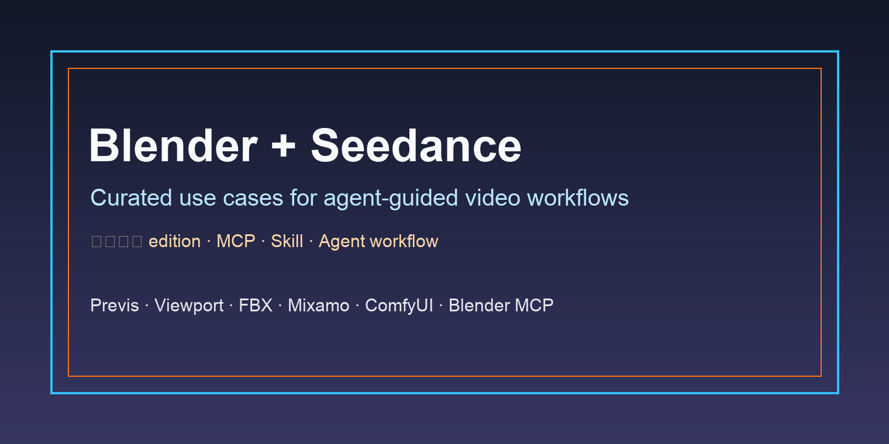

<div align="center">

<a href="#conversion-path-pending"></a>

[](LICENSE)
[](#conversion-path-pending)
[](#conversion-path-pending)
[](#conversion-path-pending)

[](README.md)
[](README_es.md)
[](README_pt.md)
[](README_ja.md)
[](README_ko.md)
[](README_de.md)
[](README_fr.md)
[](README_tr.md)
[](README_zh-TW.md)
[](README_zh-CN.md)
[](README_ru.md)

</div>

## 🍌 Introduction

Blender + Seedance 使用案例仓库。

**这里收集真实的 Blender、Blender MCP、viewport、previs、FBX、Mixamo、ComfyUI 和 agent 辅助工作流，用来控制 Seedance 视频生成。**

当前集合来自用户提供的 X/Twitter 精选数据。每个案例都链接到原帖和创作者主页。

主落地页暂缺。预期转化路径是安装 MCP、安装 EvoLink skill、充值，然后在 Agent 里使用。

## 📊 Overview

- **20 个精选 Blender + Seedance 案例**，来自用户提供数据集中公开创作者帖子。
- 覆盖相机控制、Blender previs、多角色 blocking、动作编排、Blender MCP、Codex/Claude 辅助 blockout、FBX/Mixamo 参考、ComfyUI/style transfer 和已知限制。
- 每个案例都包含原始来源、创作者署名、简明 takeaway、证据类型和发布日期。
- 公开列表已经过人工重复与原创性审计，从 35 个候选收敛为 20 个主案例。
- 这个仓库用于先展示真实工作流，再把用户引导到最终 EvoLink MCP + skill 落地页。

> [!NOTE]
> 这个集合优先保留具体证据：步骤、参考视频、agent/MCP 用法、可复现条件和明确限制，而不是空泛宣传。

<a id="-quick-api-access"></a>
## ⚡ 快速 API 入口

在最终落地页提供之前，这里记录 Seedance reference-to-video 的预期模型路径。

```bash
curl --request POST \
  --url https://direct.evolink.ai/v1/messages \
  --header 'Authorization: Bearer <token>' \
  --header 'Content-Type: application/json' \
  --data '
{
  "model": "seedance-2.0-reference-to-video",
  "max_tokens": 1024,
  "messages": [
    {
      "role": "user",
      "content": "Plan a Blender reference-video workflow for a Seedance shot."
    }
  ]
}
'
```

<a id="conversion-path-pending"></a>
## 🚧 转化路径待补齐

最终落地页仍待补齐。把仓库标记为 release-ready 之前，需要把这一节替换成最终 CTA。

## 📑 目录

| 章节 | 案例 |
|---|---|
| [🎥 Camera Control & Previs / 相机控制与预演](#camera-control-previs) | Case 1-5 |
| [🎬 Character & Action Blocking / 角色与动作 blocking](#character-action-blocking) | Case 6-9 |
| [🤖 Agentic Blender MCP / Agent 辅助 Blender MCP](#agentic-blender-mcp) | Case 10-11 |
| [🧩 Reference, Prompt & Multi-Input Mapping / 参考、prompt 与多输入映射](#reference-prompt-multi-input-mapping) | Case 12-14 |
| [🛠️ Production Pipelines & Toolchains / 生产管线与工具链](#production-pipelines-toolchains) | Case 15-18 |
| [🧪 Limits, Tests & Troubleshooting / 限制、测试与排查](#limits-tests-troubleshooting) | Case 19-20 |
| [🙏 致谢](#acknowledge) | Credits and correction policy |

<a id="camera-control-previs"></a>
### 🎥 Camera Control & Previs / 相机控制与预演

| 案例 | 展示内容 | 类型 |
|---|---|---|
| [Blender 灰盒预演 + 起始帧 + Seedance motion reference](#case-1) | 完整导演流程：先做起始帧，再用 Blender 灰盒搭镜头、只动画相机和节奏，最后把 blockout 作为 Seedance motion reference。 | Demo |
| [Blender 运镜参考 + Midjourney 起始帧 + Seedance](#case-2) | 精确运镜的三步配方：Blender 负责相机运动，Midjourney 负责起始帧，Seedance 按参考运动生成视频。 | Demo |
| [Blender previz + Comfy + 三输入控制](#case-3) | ComfyUI 控制案例：Blender previz 搭配 upright/upside-down 参考帧，测试 Seedance 的运动遵循能力。 | Demo |
| [Viewport preview 导出后进 Seedance](#case-4) | Viewport preview 教程：blockout 场景、导出预览、把首帧转成真实图，再把两类参考交给 Seedance。 | Demo |
| [同一 reference video 生成不同世界](#case-5) | 同一参考视频生成不同世界：用同一段 Blender reference 锁定运动，再让 Seedance 改变世界和风格。 | Demo |

<a id="character-action-blocking"></a>
### 🎬 Character & Action Blocking / 角色与动作 blocking

| 案例 | 展示内容 | 类型 |
|---|---|---|
| [多角色 + 对话 + 精准运镜](#case-6) | 多角色对话镜头：先在 Blender 里匹配角色姿势和相机运动，再让 Seedance 生成表演结果。 | Demo |
| [复杂动作场景编排](#case-7) | 动作戏预演：用 Blender 规划粗略时序、速度、抖动和空间调度，再交给 Seedance 渲染成片。 | Demo |
| [手持跟拍 + 角色绕车运动](#case-8) | 手持跟拍：Blender 控制角色穿越空间和相机跟随，Seedance 把这种粗粝跟拍感带到最终视频。 | Demo |
| [角色 blocking + 相机 blocking 同时控制](#case-9) | 战术动作 blocking：在生成前用 Blender 规划相机环绕、镜头、掩体位置、枪火节奏和角色移动。 | Demo |

<a id="agentic-blender-mcp"></a>
### 🤖 Agentic Blender MCP / Agent 辅助 Blender MCP

| 案例 | 展示内容 | 类型 |
|---|---|---|
| [Codex + Blender MCP 生成场景/动作/参照视频](#case-10) | Agentic Blender MCP 案例：Codex 生成简易市场、猫的动作、相机构图，并导出给 Seedance 的 MP4 参考。 | Integration |
| [Codex 生成 Blender 建筑和 camera work 后送 Seedance](#case-11) | Codex 辅助新手案例：建筑和 camera work 由 Codex 在 Blender 中生成，再测试 Seedance 参考运动。 | Integration |

<a id="reference-prompt-multi-input-mapping"></a>
### 🧩 Reference, Prompt & Multi-Input Mapping / 参考、prompt 与多输入映射

| 案例 | 展示内容 | 类型 |
|---|---|---|
| [日本语复现条件 + 完整 prompt](#case-12) | 可复现 prompt 案例：起始帧、Blender 参考视频、Seedance 版本、时长和运动约束都写清楚。 | Tutorial |
| [Blender blocking + 多参考图 + 角色锁定 prompt](#case-13) | 参考映射案例：用 Blender blocking 加多张角色/环境参考，告诉 Seedance 哪个运动物体对应哪个角色。 | Tutorial |
| [Mixamo motion + Blender + Seedance 初学者路径](#case-14) | 新手运动来源案例：从 Mixamo 拿动作导入 Blender，作为可控运动基础后再送入 Seedance。 | Tutorial |

<a id="production-pipelines-toolchains"></a>
### 🛠️ Production Pipelines & Toolchains / 生产管线与工具链

| 案例 | 展示内容 | 类型 |
|---|---|---|
| [Hermes/Krea2/ComfyUI/Blender MCP/Seedance 实验](#case-15) | 多工具 agent 管线：Hermes 安装并连接 Krea、ComfyUI、Blender MCP 和 Seedance，生成图像与物理参考。 | Integration |
| [Blender MCP viewport animation + Seedance/Magnific texture/lighting](#case-16) | Viewport 到风格化案例：Blender MCP 提供相机和元素控制，再用 Seedance/Magnific 加纹理和光照。 | Integration |
| [Blender 3D previz → Seedance anime render](#case-17) | 3D previz 到动画渲染：用 Seedance 改变画面风格，同时保留 Blender 里的相机运动和动作。 | Integration |
| [FBX clay model + Claude keyframe + Seedance refs](#case-18) | FBX clay pass 流程：Blender 导入动作，Claude 辅助关键帧相机，渲染后的 clay pass 成为 Seedance 参考视频。 | Integration |

<a id="limits-tests-troubleshooting"></a>
### 🧪 Limits, Tests & Troubleshooting / 限制、测试与排查

| 案例 | 展示内容 | 类型 |
|---|---|---|
| [相机/节奏/移动控制实验与失败点](#case-19) | 限制排查案例：Blender 能控制相机、节奏和移动路径，但自然脚步动作仍然容易出问题。 | Limit |
| [不用 start frame 的 Blender blockout reference](#case-20) | 无起始帧变体：当不能依赖 starter frame 时，用 Blender blockout 加详细环境参考也能工作。 | Limit |

<a id="camera-control-previs-cases"></a>
## 🎥 Camera Control & Previs / 相机控制与预演

<a id="case-1"></a>
### Case 1: [Blender 灰盒预演 + 起始帧 + Seedance motion reference](https://x.com/noman23761/status/2071534020014563328) (by [@noman23761](https://x.com/noman23761))

**完整导演流程：先做起始帧，再用 Blender 灰盒搭镜头、只动画相机和节奏，最后把 blockout 作为 Seedance motion reference。**

- 来源笔记：完整说明从 image model 起始帧、Blender 灰盒场景/相机动画，到 Seedance 参考视频生成的端到端流程。
- 复用角度：可直接改写成“用 Blender blockout 精准导演 AI 镜头”的主 use case。


类型: Demo | 日期: 2026-06-29

---

<a id="case-2"></a>
### Case 2: [Blender 运镜参考 + Midjourney 起始帧 + Seedance](https://x.com/reidhannaford/status/2069074506849685773) (by [@reidhannaford](https://x.com/reidhannaford))

**精确运镜的三步配方：Blender 负责相机运动，Midjourney 负责起始帧，Seedance 按参考运动生成视频。**

- 来源笔记：列出 3 步 workflow：Blender block camera、Midjourney start frame、两者送入 Seedance。
- 复用角度：适合做 precision camera control 的基础案例。
- 本地媒体: [video-2069074144986021888-1920x2160.mp4](media/case-02/video-2069074144986021888-1920x2160.mp4)

类型: Demo | 日期: 2026-06-22

---

<a id="case-3"></a>
### Case 3: [Blender previz + Comfy + 三输入控制](https://x.com/JMSvid/status/2070258132840796579) (by [@JMSvid](https://x.com/JMSvid))

**ComfyUI 控制案例：Blender previz 搭配 upright/upside-down 参考帧，测试 Seedance 的运动遵循能力。**

- 来源笔记：说明用 Blender previz 作为 guide，并配 upright/upside-down reference frames。
- 复用角度：适合做多输入相机控制 case。
- 本地媒体: [video-2070258074795868160-1080x1920.mp4](media/case-03/video-2070258074795868160-1080x1920.mp4)

类型: Demo | 日期: 2026-06-25

---

<a id="case-4"></a>
### Case 4: [Viewport preview 导出后进 Seedance](https://x.com/DiabloNemesis/status/2070441923706503380) (by [@DiabloNemesis](https://x.com/DiabloNemesis))

**Viewport preview 教程：blockout 场景、导出预览、把首帧转成真实图，再把两类参考交给 Seedance。**

- 来源笔记：明确流程：Blender block out scene、export viewport preview、抽第一帧转真实图、作为 reference 送 Seedance。
- 复用角度：适合做 viewport preview → Seedance 的短教程案例。
- 本地媒体: [video-2070441712242319360-1920x2160.mp4](media/case-04/video-2070441712242319360-1920x2160.mp4)

类型: Demo | 日期: 2026-06-26

---

<a id="case-5"></a>
### Case 5: [同一 reference video 生成不同世界](https://x.com/koldo2k/status/2071307945002815967) (by [@koldo2k](https://x.com/koldo2k))

**同一参考视频生成不同世界：用同一段 Blender reference 锁定运动，再让 Seedance 改变世界和风格。**

- 来源笔记：说明用 Blender 控制、Seedance 想象，同一 reference video 生成不同 worlds，并提到 prompt。
- 复用角度：适合做 style/world variation case。
- 本地媒体: [video-2071307859149631488-1920x1080.mp4](media/case-05/video-2071307859149631488-1920x1080.mp4)

类型: Demo | 日期: 2026-06-28

---

<a id="character-action-blocking-cases"></a>
## 🎬 Character & Action Blocking / 角色与动作 blocking

<a id="case-6"></a>
### Case 6: [多角色 + 对话 + 精准运镜](https://x.com/reidhannaford/status/2069420552394043625) (by [@reidhannaford](https://x.com/reidhannaford))

**多角色对话镜头：先在 Blender 里匹配角色姿势和相机运动，再让 Seedance 生成表演结果。**

- 来源笔记：说明用 Midjourney 起始帧、Blender pose/camera，再交给 Seedance，实现两个一致角色和对话镜头。
- 复用角度：适合做多角色表演/对话场景 use case。
- 本地媒体: [video-2069409826589818880-1920x2160.mp4](media/case-06/video-2069409826589818880-1920x2160.mp4)

类型: Demo | 日期: 2026-06-23

---

<a id="case-7"></a>
### Case 7: [复杂动作场景编排](https://x.com/reidhannaford/status/2070145120658137385) (by [@reidhannaford](https://x.com/reidhannaford))

**动作戏预演：用 Blender 规划粗略时序、速度、抖动和空间调度，再交给 Seedance 渲染成片。**

- 来源笔记：明确说明用 Blender basic shapes 编排 action scene，Seedance 负责真实化。
- 复用角度：适合做动作戏/空间调度 use case。
- 本地媒体: [video-2070142533275877376-1440x2160.mp4](media/case-07/video-2070142533275877376-1440x2160.mp4)

类型: Demo | 日期: 2026-06-25

---

<a id="case-8"></a>
### Case 8: [手持跟拍 + 角色绕车运动](https://x.com/reidhannaford/status/2070507963429671062) (by [@reidhannaford](https://x.com/reidhannaford))

**手持跟拍：Blender 控制角色穿越空间和相机跟随，Seedance 把这种粗粝跟拍感带到最终视频。**

- 来源笔记：说明在 Blender 中移动角色并做 handheld camera follow，Seedance 跟随运动和质感。
- 复用角度：适合做手持跟拍、角色移动穿越空间的案例。
- 本地媒体: [video-2070507396921733120-1440x2160.mp4](media/case-08/video-2070507396921733120-1440x2160.mp4)

类型: Demo | 日期: 2026-06-26

---

<a id="case-9"></a>
### Case 9: [角色 blocking + 相机 blocking 同时控制](https://x.com/SamJWasserman/status/2070742850095230991) (by [@SamJWasserman](https://x.com/SamJWasserman))

**战术动作 blocking：在生成前用 Blender 规划相机环绕、镜头、掩体位置、枪火节奏和角色移动。**

- 来源笔记：明确实现 camera orbit、lens choice、gunfire/cover positions/pop-outs，并说 prompt below。
- 复用角度：适合做动作场景 tactical blocking case。
- 本地媒体: [video-2070742547706880000-1920x1080.mp4](media/case-09/video-2070742547706880000-1920x1080.mp4), [video-2070742709737029632-1920x1080.mp4](media/case-09/video-2070742709737029632-1920x1080.mp4)

类型: Demo | 日期: 2026-06-27

---

<a id="agentic-blender-mcp-cases"></a>
## 🤖 Agentic Blender MCP / Agent 辅助 Blender MCP

<a id="case-10"></a>
### Case 10: [Codex + Blender MCP 生成场景/动作/参照视频](https://x.com/akiyoshisan/status/2071081230108660199) (by [@akiyoshisan](https://x.com/akiyoshisan))

**Agentic Blender MCP 案例：Codex 生成简易市场、猫的动作、相机构图，并导出给 Seedance 的 MP4 参考。**

- 来源笔记：列出 Blender MCP 连接 Codex、生成猫/市场/屋台、15 秒 motion、camera work、导出 MP4 reference 的完整流程。
- 复用角度：适合做 Agentic Blender MCP + Seedance use case。
- 本地媒体: [video-2071081165398958080-1080x1440.mp4](media/case-10/video-2071081165398958080-1080x1440.mp4)

类型: Integration | 日期: 2026-06-28

---

<a id="case-11"></a>
### Case 11: [Codex 生成 Blender 建筑和 camera work 后送 Seedance](https://x.com/6_KAKUU/status/2071051063663452374) (by [@6_KAKUU](https://x.com/6_KAKUU))

**Codex 辅助新手案例：建筑和 camera work 由 Codex 在 Blender 中生成，再测试 Seedance 参考运动。**

- 来源笔记：说明 Blender 初学第 3 天，建筑到 camera work 都由 Codex 完成，Seedance 能跟随。
- 复用角度：适合做 Codex-assisted camera work case。
- 本地媒体: [image-01.jpg](media/case-11/image-01.jpg), [video-2071051005316521984-1080x1216.mp4](media/case-11/video-2071051005316521984-1080x1216.mp4)

类型: Integration | 日期: 2026-06-28

---

<a id="reference-prompt-multi-input-mapping-cases"></a>
## 🧩 Reference, Prompt & Multi-Input Mapping / 参考、prompt 与多输入映射

<a id="case-12"></a>
### Case 12: [日本语复现条件 + 完整 prompt](https://x.com/aidoga_lab/status/2070864815275585913) (by [@aidoga_lab](https://x.com/aidoga_lab))

**可复现 prompt 案例：起始帧、Blender 参考视频、Seedance 版本、时长和运动约束都写清楚。**

- 来源笔记：给出 start frame、Blender reference video、Seedance 2.0、5s、以及长 prompt。
- 复用角度：适合做可复现 prompt/source case。
- 本地媒体: [image-01.jpg](media/case-12/image-01.jpg), [video-2070864756530171904-810x1080.mp4](media/case-12/video-2070864756530171904-810x1080.mp4)

类型: Tutorial | 日期: 2026-06-27

---

<a id="case-13"></a>
### Case 13: [Blender blocking + 多参考图 + 角色锁定 prompt](https://x.com/AIWarper/status/2069481237308452916) (by [@AIWarper](https://x.com/AIWarper))

**参考映射案例：用 Blender blocking 加多张角色/环境参考，告诉 Seedance 哪个运动物体对应哪个角色。**

- 来源笔记：给出 Seedance prompt，把 motion/blocking reference 中的角色映射到指定角色参考图。
- 复用角度：适合做 prompt engineering + character mapping case。
- 本地媒体: [image-01.jpg](media/case-13/image-01.jpg), [image-02.jpg](media/case-13/image-02.jpg), [image-03.jpg](media/case-13/image-03.jpg)

类型: Tutorial | 日期: 2026-06-23

---

<a id="case-14"></a>
### Case 14: [Mixamo motion + Blender + Seedance 初学者路径](https://x.com/tanabe_fragm/status/2070685291183243459) (by [@tanabe_fragm](https://x.com/tanabe_fragm))

**新手运动来源案例：从 Mixamo 拿动作导入 Blender，作为可控运动基础后再送入 Seedance。**

- 来源笔记：测试 Blender x Seedance，并建议初学者下载 Mixamo motion 导入 Blender。
- 复用角度：适合做 beginner motion-source case。
- 本地媒体: [video-2070683855447871488-1920x2160.mp4](media/case-14/video-2070683855447871488-1920x2160.mp4)

类型: Tutorial | 日期: 2026-06-27

---

<a id="production-pipelines-toolchains-cases"></a>
## 🛠️ Production Pipelines & Toolchains / 生产管线与工具链

<a id="case-15"></a>
### Case 15: [Hermes/Krea2/ComfyUI/Blender MCP/Seedance 实验](https://x.com/SamJWasserman/status/2069656428437225826) (by [@SamJWasserman](https://x.com/SamJWasserman))

**多工具 agent 管线：Hermes 安装并连接 Krea、ComfyUI、Blender MCP 和 Seedance，生成图像与物理参考。**

- 来源笔记：说明 agent 安装 Krea2、连接 ComfyUI 和 Blender MCP，生成 reference image + physical ref vid 后送 Seedance。
- 复用角度：适合做 multi-agent creative pipeline 候选。
- 本地媒体: [image-01.jpg](media/case-15/image-01.jpg), [video-2069656156398850048-3072x1728.mp4](media/case-15/video-2069656156398850048-3072x1728.mp4), [video-2069656297624969216-1280x720.mp4](media/case-15/video-2069656297624969216-1280x720.mp4)

类型: Integration | 日期: 2026-06-24

---

<a id="case-16"></a>
### Case 16: [Blender MCP viewport animation + Seedance/Magnific texture/lighting](https://x.com/techhalla/status/2070814203435274715) (by [@techhalla](https://x.com/techhalla))

**Viewport 到风格化案例：Blender MCP 提供相机和元素控制，再用 Seedance/Magnific 加纹理和光照。**

- 来源笔记：说明 adding 3D gives camera/element control，并声称 exactly how I did it。
- 复用角度：适合做 Blender MCP + style transfer 主案例。
- 本地媒体: [image-01.jpg](media/case-16/image-01.jpg), [video-2070810169966018561-1920x1080.mp4](media/case-16/video-2070810169966018561-1920x1080.mp4)

类型: Integration | 日期: 2026-06-27

---

<a id="case-17"></a>
### Case 17: [Blender 3D previz → Seedance anime render](https://x.com/restofart/status/2070086939756159368) (by [@restofart](https://x.com/restofart))

**3D previz 到动画渲染：用 Seedance 改变画面风格，同时保留 Blender 里的相机运动和动作。**

- 来源笔记：说明 full camera moves and motion preserved，定位 previz → AI-render pipeline。
- 复用角度：适合作为 anime/render pipeline case。
- 本地媒体: [video-2070086817710211072-1000x1100.mp4](media/case-17/video-2070086817710211072-1000x1100.mp4)

类型: Integration | 日期: 2026-06-25

---

<a id="case-18"></a>
### Case 18: [FBX clay model + Claude keyframe + Seedance refs](https://x.com/Viggle_PINOC/status/2070183934265012392) (by [@Viggle_PINOC](https://x.com/Viggle_PINOC))

**FBX clay pass 流程：Blender 导入动作，Claude 辅助关键帧相机，渲染后的 clay pass 成为 Seedance 参考视频。**

- 来源笔记：具体 step：Blender 导入 FBX 到 clay model、设置 camera、Claude keyframe camera moves、导出 mp4 给 Seedance refs。
- 复用角度：适合做 FBX/Mixamo 动画参考流程。
- 本地媒体: [video-2070182579253215232-1916x1080.mp4](media/case-18/video-2070182579253215232-1916x1080.mp4)

类型: Integration | 日期: 2026-06-25

---

<a id="limits-tests-troubleshooting-cases"></a>
## 🧪 Limits, Tests & Troubleshooting / 限制、测试与排查

<a id="case-19"></a>
### Case 19: [相机/节奏/移动控制实验与失败点](https://x.com/aidoga_lab/status/2070864749865398684) (by [@aidoga_lab](https://x.com/aidoga_lab))

**限制排查案例：Blender 能控制相机、节奏和移动路径，但自然脚步动作仍然容易出问题。**

- 来源笔记：说明用 Blender 视频控制 Seedance 的 camera/rhythm/subject movement，同时指出 foot sliding 问题。
- 复用角度：适合做 limitations + troubleshooting case。
- 本地媒体: [video-2070864673227038720-1920x1080.mp4](media/case-19/video-2070864673227038720-1920x1080.mp4)

类型: Limit | 日期: 2026-06-27

---

<a id="case-20"></a>
### Case 20: [不用 start frame 的 Blender blockout reference](https://x.com/magneticskiff/status/2070711034793361559) (by [@magneticskiff](https://x.com/magneticskiff))

**无起始帧变体：当不能依赖 starter frame 时，用 Blender blockout 加详细环境参考也能工作。**

- 来源笔记：说明 Seedance + Blender blockout 可以使用 references 而非 starter frames，环境参考有足够细节时效果较好。
- 复用角度：适合做 reference-only variant 候选。
- 本地媒体: [video-2070709263517847552-1080x1350.mp4](media/case-20/video-2070709263517847552-1080x1350.mp4)

类型: Limit | 日期: 2026-06-27

---

<a id="acknowledge"></a>
## 🙏 致谢

This repository was inspired by creators who publicly shared Blender + Seedance workflows, tests, prompts, reference videos, and production notes.

- [@noman23761](https://x.com/noman23761)
- [@reidhannaford](https://x.com/reidhannaford)
- [@JMSvid](https://x.com/JMSvid)
- [@DiabloNemesis](https://x.com/DiabloNemesis)
- [@koldo2k](https://x.com/koldo2k)
- [@SamJWasserman](https://x.com/SamJWasserman)
- [@akiyoshisan](https://x.com/akiyoshisan)
- [@6_KAKUU](https://x.com/6_KAKUU)
- [@aidoga_lab](https://x.com/aidoga_lab)
- [@AIWarper](https://x.com/AIWarper)
- [@tanabe_fragm](https://x.com/tanabe_fragm)
- [@techhalla](https://x.com/techhalla)
- [@restofart](https://x.com/restofart)
- [@Viggle_PINOC](https://x.com/Viggle_PINOC)
- [@magneticskiff](https://x.com/magneticskiff)

*We cannot guarantee that every case is attributed to the original creator. If anything needs to be corrected, please contact us and we will update it.*

If you have more interesting usage cases to share, open an issue or pull request and help expand the EvoLink usecase library.

[](https://www.star-history.com/#cheercheung/Awesome-Blender-Seedance-Workflow-Usecases&Date)

